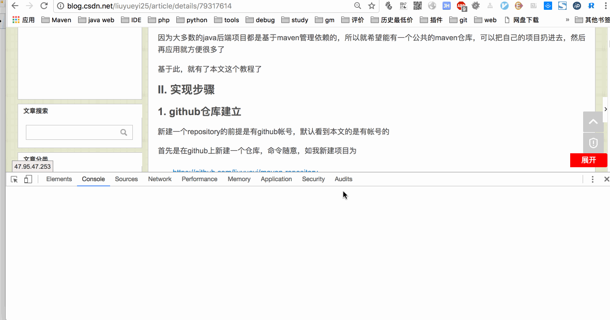

# Chrome-ImgRender

chrome插件之网页dom结构渲染

## 功能说明

主要实现将当前网页中的某些dom结构，渲染输出png图片，便于分享

源码：[src/](src/)

## 安装&使用

### 1. 安装过程

1. 下载工程目录下的 [package/Chrome-ImgRender.crx](package/Chrome-ImgRender.crx)

2. chrome浏览器输入 [chrome://extensions/](chrome://extensions/)

3. 将下载的crx包，拖到网页，选择安装

### 2. 使用演示

插件安装完毕之后，打开网页，右下角会多一个按钮，点击之后，显示一个输入框和一个按钮

- 找到需要渲染的dom结构
- 如果dom有唯一的id，则输入框中填： `id:xxx`
- 如果dom上只有class，则输入框中填： `cid:xxx`
	- 如果class是重复的时候，可以通过在后面加上 `#序号` 来指定具体需要渲染的标签，其中序号是以（0）开始的数字
- 填写完成之后，回车或者点击右边的渲染按钮
- 会弹出一个网页，显示渲染的图片

**说明**

如果弹窗被浏览器提示拦截，请允许弹窗

**实例演示**

## 其他

### 个人博客： [Z+|blog](https://liuyueyi.github.io/hexblog)

基于hexo + github pages搭建的个人博客，记录所有学习和工作中的博文，欢迎大家前去逛逛

### 声明

尽信书则不如，已上内容，纯属一家之言，因本人能力一般，见识有限，如发现bug或者有更好的建议，随时欢迎批评指正，我的微博地址: [小灰灰Blog](https://weibo.com/p/1005052169825577/home)

### 扫描关注

公众号&博客

打赏码

